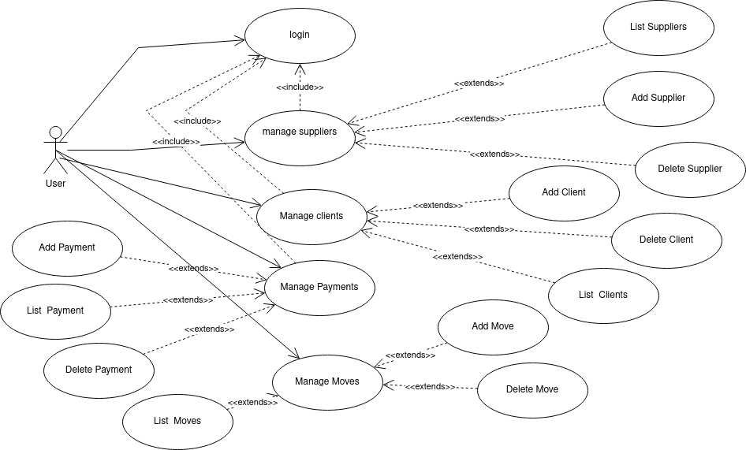
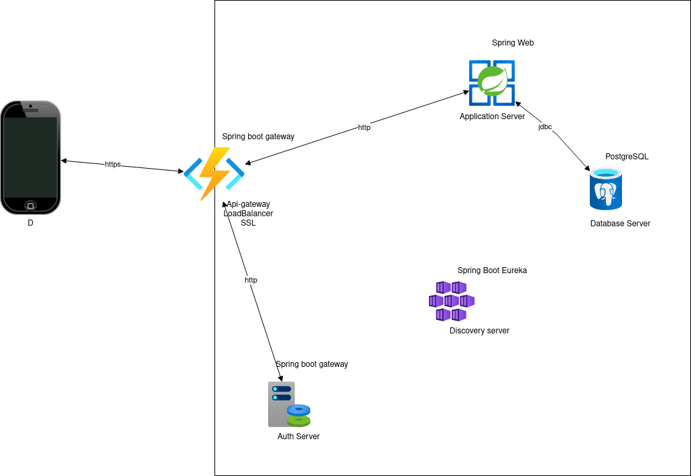
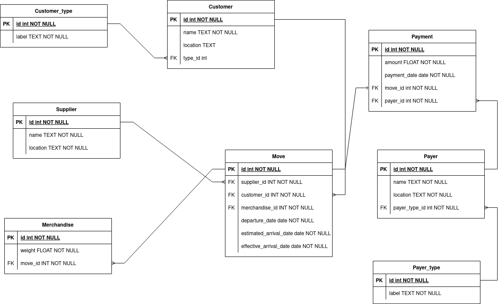

# PAYMENT TRACKER

In a transit company, it's critical  to have a history of all the flux like
moves of merchandises, payment to the suppliers and other.

With this application, we want to provide a way to automate those moves

## Features

## Architecture

## DB Design
